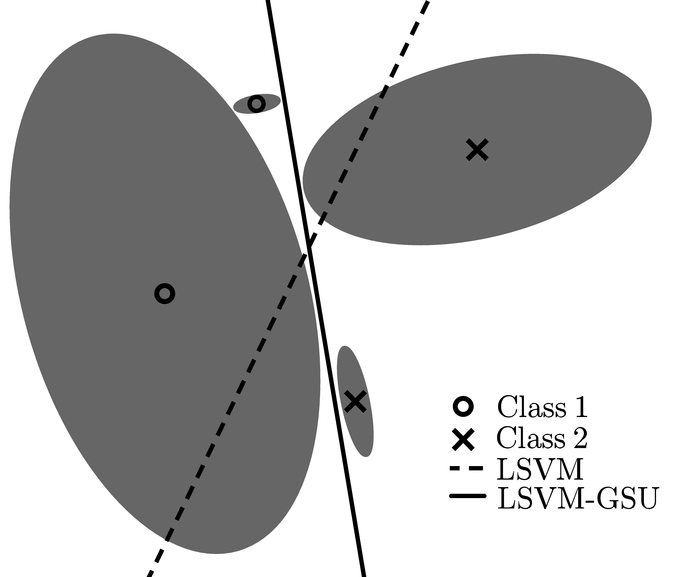

# svm-gsu

A C++ framework for training/testing Support Vector Machine with Gaussian Sample Uncertainty (SVM-GSU).

This is the implementation code for the Linear SVM Gaussian Sample Uncertainty (LSVM-GSU), which was first proposed in [1], and the Kernel SVM Gaussian Sample Uncertainty (KSVM-iGSU), proposed in [2]. If you want to use one of the above classifiers, please consider citing the appropriate references (see at the end of this document).

#### 0. Prerequisites

The code is built in C++11 using the [Eigen](http://eigen.tuxfamily.org/index.php?title=Main_Page) library.

    - Eigen ??.??
    - ???

##### Linux

##### Windows

​    

#### 1. Linear SVM with Gaussian Sample Uncertainty (LSVM-GSU) [1]

  

##### 1.1 Motivation

An illustration is given in Fig.~\ref{fig:svm_gsu}, where the shaded regions are bounded by iso-density loci of the Gaussians, and the means of the Gaussians for examples of the positive and negative classes are located at $\times$ and $\circ$ respectively. A classical SVM formulation would consider only the means of the Gaussians as training examples and, by optimizing the soft margin using the hinge loss and a regularization term, would arrive at the separating hyperplane depicted by the dashed line. In our formulation, we optimize for the soft margin using the same regularization but the {\em expected} value of the hinge loss, where the expectation is taken under the given Gaussians. By doing so, we take into consideration the various uncertainties and arrive at a drastically different decision border, depicted by the solid line in Fig.~\ref{fig:svm_gsu}. It is worth noting that one would arrive at the same decision border with the classical SVM trained on a dataset containing samples drawn from the Gaussians in question, as the number of samples tend to infinity. In addition, our method degenerates to a classical SVM in the case that all of the Gaussians are isotropic with a variance that tends to zero.

###### 1.1.1 AAA

#### 2. Kernel SVM with Isotropic Gaussian Sample Uncertainty (KSVM-iGSU) [2,3]

Not available yet...

#### 3. Visualization of LSVM-GSU/KSVM-iGSU

A visualization tool build in Matlab is available under XXX/

#### References

[1] Tzelepis, Christos, Vasileios Mezaris, and Ioannis Patras. "Linear Maximum Margin Classifier for Learning from Uncertain Data." *IEEE Transactions on pattern analysis and machine intelligence* XX.YY (2017): pppp-pppp.

[2] Tzelepis, Christos, Vasileios Mezaris, and Ioannis Patras. "Video event detection using kernel support vector machine with isotropic gaussian sample uncertainty (KSVM-iGSU)." *International Conference on Multimedia Modeling*. Springer, Cham, 2016.

[3] Tzelepis, Christos, Eftichia Mavridaki, Vasileios Mezaris, and Ioannis Patras. "Video aesthetic quality assessment using kernel Support Vector Machine with isotropic Gaussian sample uncertainty (KSVM-iGSU)." In *Image Processing (ICIP), 2016 IEEE International Conference on*, pp. 2410-2414. IEEE, 2016.